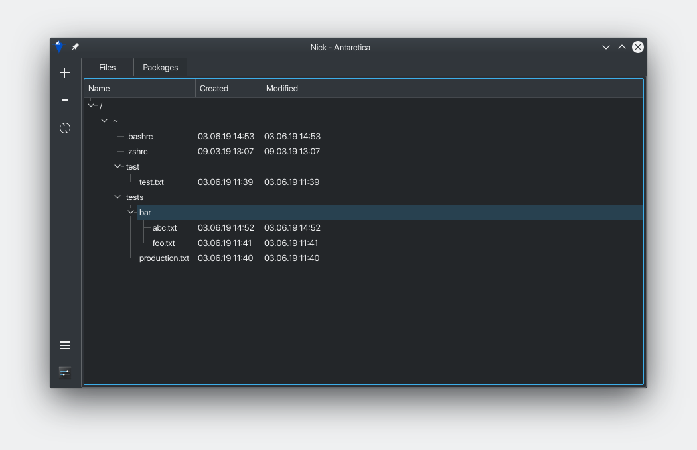

# Antarctica

Antarctica is an open-source project aiming to perform comfortable in-cloud backup of user files, installed packages list and dotfiles.

Current edition is a port of archived [Kotlin version](https://github.com/mad-penguins/AntarcticaKt) to C++/Qt.
It's being ported because of hardness of deployment an the most Linux installations.
Mostly it's caused by unavailability of Java SE 8 or OpenFX for Java 9 or newer.

Features (work still in progress):
- [ ] Files management
    - [x] Uploading into server
    - [x] Downloading from server
    - [ ] Deleting from disk
    - [x] Deleting from server
- [ ] Packages management (zypper only now)
    - [x] Uploading into server (by one, not full list)
    - [x] Binding of package and dotfiles
    - [ ] Installing into system
    - [ ] Removing from system
    - [x] Removing from server
- [ ] Repositories management (zypper only now)
    - [x] Reading list of added repositories
    - [ ] Adding into system
    - [x] Removing from system
- [ ] User interface
    - [x] Files management tab
    - [x] Packages management tab
    - [ ] Repositories management tab
    - [x] Settings
    - [ ] Custom design
 - [ ] Under the hood
    - [x] Security
        - [x] Connection through HTTPS
    - [x] Real-time files' states changes monitoring

Roadmap ~~can~~ will be extended in the future.

Antarctica server is at the moment under development too. Code of server is closed and may be still unstable in some behaviour cases.
Public remote server is being tested now. Open API will be ~~opened~~ documented in the future.
There's already present a preview of [API wrapper for Qt](https://github.com/mad-penguins/IcebreakerQt). There's also the [Antarctica API reference](https://github.com/mad-penguins/IcebreakerQt/wiki), which is being filled now.

## Build
Antarctica is build with Qt framework and based on CMake build system.
So, you need to install cmake binary, C++ compiler with C++17 standard support and Qt5 runtime and development packages.
If you want to build an RPM package (Debian packages will be supported in the near future), you also need to install the rpmbuild.

##### Needed packages
1. `git`
2. `cmake`
3. `clang` or `g++`(Debian-based) / `gcc-g++`(openSUSE)
4.  Qt Packages (or just install Qt from official website and specify it to CMake with `-DCMAKE_PREFIX_PATH` flag)
    - Ubuntu
        - `libqt5core5a`
        - `libqt5widgets5`
        - `libqt5network5`
    - openSUSE
        - `libQt5Core-devel`
        - `libQt5Widgets-devel`
        - `libQt5Network-devel`

##### Build process:
1. `$ git clone https://github.com/mad-penguins/Antarctica`
2. `$ cd Antarctica`
3. `$ git submodules update --init`
4. `$ mkdir build && cd build`
5. `$ cmake .. && make` (you can specify number of cores used for compilation with flag `-j`, e.g. `-j 4`)
6. (Optional) make an RPM: `$ make package`

##### Troubleshooting
If step 3 won't  work for you, you can clone API wrapper repository manually and put it to the `api` directory:

`$ git clone https://github.com/mad-penguins/IcebreakerQt && mv IcebreakerQt/ api/`

There's also some [prebuilt binaries](https://github.com/mad-penguins/Antarctica/releases).

## Support
You can help us to rent a server and also support the development:
- WebMoney: R710781308549
- [Yandex Money](https://money.yandex.ru/to/410015281707280)

Any suggestions and contributions are welcome. Let's make Linux much more user friendly!
